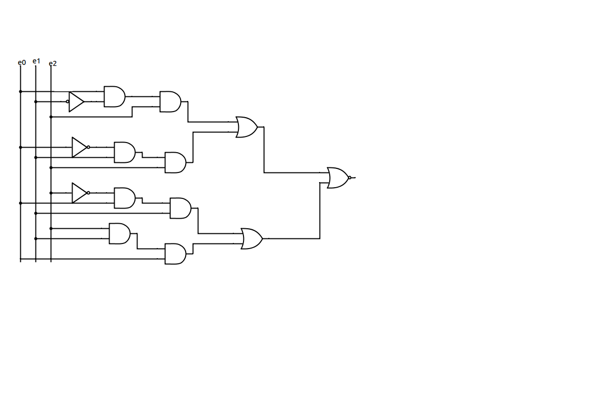
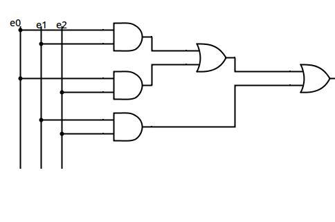
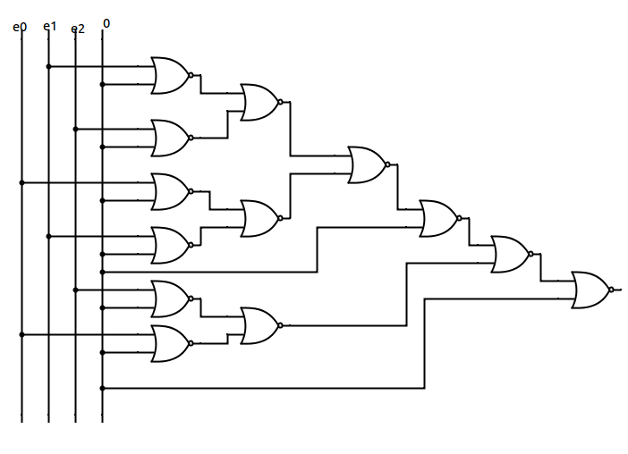

# Examen 2013-2014 Architecture, Sujet D

## Exercice 1

### a)

S = /e2.e1.e0 + e2./e1.e0 + e2.e1./e0 + e2.e1.e0

### b)

Il est possible d'éviter les portes NOT, pour ça il faut refaire la formule, on se sert d'un tableau de karnaugh:

|e2\e1e0| 00 |  01 | 11 | 10 |
|-------|:--:|:---:|:--:|:--:|
| **0** |  0 |  0  |  1 |  0 |
| **1** |  0 |  1  |  1 |  1 |

S = e2e1 + e0e1 + e0e2

### c)

Pour se contenter d'utiliser des portes NOR, on utilise les formules suivantes:

a+b = /(/(a+b)+0)

a.b = /(/(a+0)+/(b+0))

## Exercice 2

ligne   | label      | Instructions          |  valeurs | Commentaires |
--------|------------|-----------------------|----------|--------------|
0       |            |      ORIG             |  x3000   |      |
1       |  mystere:  |  LD                   |R0, value ||
2       |            |    JSR                |    myst  | |     
3       |            |   TRAP                |  x26      | ; HALT|
4       |  value:    | .FILL                 | 21        ||
.       |            |                       |           | |
5       |   myst:    |   ADD                 | R6, R6,-1 ||
6       |            |    STR                |  R1, R6, 0 ||
7       |            |    AND                |  R1, R1, 0 ||
8       |            |    AND                |  R0, R0, R0||
9       |            |    BRz                | fini       ||
10      |            |    BRp                |  bit0      ||
11      |  bit1:     |    ADD                |   R1, R1, 1||
12      |  bit0:     |    ADD                | R0, R0, R0 ||
13      |            |    BRp                |  bit0      ||
14      |            |    BRn                |  bit1      ||
15      |   fini:    |    ADD                |  R0, R1, 0 ||
16      |            |    LDR                |  R1, R6, 0 ||
17      |            |    ADD                |  R6, R6, 1 ||
18      |            |    RET                |            ||
19      |            |   .END          
### a)

Resultat: 

ligne | result |
------|--------|
1    | R0 = 21|
2    | go myst|
5    | R6 = -1|
6    | R1 = R6|
7    | R1 = 0 |
8    | R0 = R0|
10   | go bit0|
12   | R0 = R0*2|
13   | go bit0|
.     | *R0 va doubler, jusq'a ce que le decalage de bits vers la gauche le mette a un nombre negatif(10101000)*|
13   | *R0 n'est pas superieur a 0*|
14   | go bit1|
11   | R1 = 0 |
12    | *R0 est decalé vers la gauche, 01010000*
13   | go bit0|
.     | *boucle jusqu'a ce que R0 vale 0 (R1 = 2)*|
14   | *R0 n'est pas negatif*|
15   | R0 = 2 |
16   | R1 = -1 |
17   | R1 = 0 |
18   | go instr 3 |
3    | fin |
   
R0 vaut 2;

### b) 

Si R0 = 0, alors R0 = 0

Si R0 = 1, alors R0 = 0

Si R0 = 3, alors R1 = 1

### c)

Compte le nombre de 1 binaire conteneu dans R0, et renvoit le resultat -1

## Exercice 3

