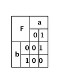
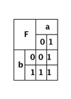
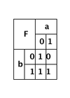
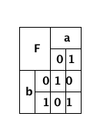
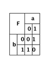
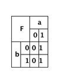
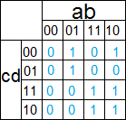
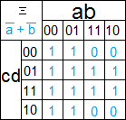

# Correction du TD 1 de Circuits et Architecture, année 2013/2014

## Exercice 1

La fonction renvoit `1` tant que `b` vaut `1`, peut importe la valeur de `a`. On
a donc `F(a,b) = b`.

## Exercice 2

### Exercice 2.1

### Exercice 2.2

### Exercice 2.3

### Exercice 2.4

### Exercice 2.5

### Exercice 2.6

### Exercice 2.7

## Exercice 3

### Exercice 3.1

### Exercice 3.2

  
_voir la 1ere case pour l'expression simplifiée_

## Exercice 4

1 - (NON c) + b  
2 - b EQ d  
3 - (NON c).d + d.(NON a) + (NON b).(NON c)  
4 - NON( b EQ d)

## Exercice 5 

1 - (a.b).c  
2 - (a.b)+c  
3 - (a+b)+c  
4 - (a+c).(c+b)  
5 - NON( NON(a+b) + NON(c) )  
6 - (a XOR b)+(c XOR b)  